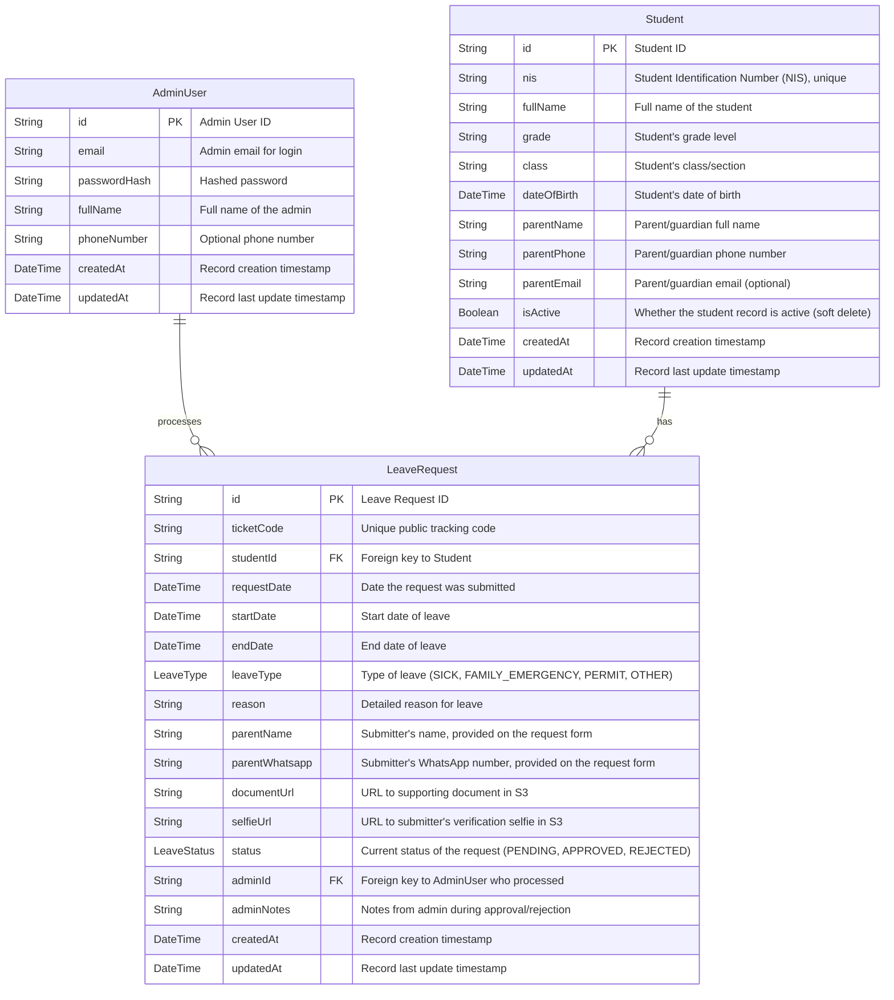

# DATABASE.md: IzinSiswa: Aplikasi Perizinan Digital

This document outlines the database schema for the IzinSiswa application, detailing the core entities, their attributes, and relationships. The design prioritizes data integrity, scalability, and efficient retrieval of information pertinent to student leave requests.

Parents/guardians do **not** have user accounts — they are matched to a `Student` record via public search (name/NIS) and are identified thereafter only by that student's stored contact fields. The only accounts in the system belong to school Admins.

## Entity Relationship Diagram (ERD)

The following Mermaid diagram illustrates the relationships between the primary entities in the IzinSiswa database.



## Table Definitions

This section details the primary business tables, their purpose, and key fields.

### AdminUser

Stores school administrator accounts only. This is the sole table used for authentication and access control — Parent/Guardian users never appear here.

*   **`id`**: Unique identifier for the admin (UUID).
*   **`email`**: Admin's email address, used for login (unique).
*   **`passwordHash`**: Hashed password for secure authentication.
*   **`fullName`**: The full name of the admin.
*   **`phoneNumber`**: Optional contact phone number.
*   **`createdAt`**: Timestamp when the record was created.
*   **`updatedAt`**: Timestamp of the last update to the record.

### Student

Contains details about each student registered in the system, including the parent/guardian's contact information. There is no linked parent account — contact fields live directly on this record and are what Admins enter and what search/matching is performed against.

*   **`id`**: Unique identifier for the student (UUID).
*   **`nis`**: Student Identification Number / NIS (unique). Primary lookup key for the public search.
*   **`fullName`**: The full name of the student. Secondary lookup key for the public search.
*   **`grade`**: The student's current grade level (e.g., "10", "XI").
*   **`class`**: The student's class or section (e.g., "A", "IPA 1").
*   **`dateOfBirth`**: The student's date of birth.
*   **`parentName`**: Full name of the parent/guardian, entered by the Admin. Optional at creation time (e.g., when a student is created via bulk Excel import) and can be completed later via the edit form.
*   **`parentPhone`**: Phone number of the parent/guardian, entered by the Admin. Optional at creation time for the same reason as `parentName`.
*   **`parentEmail`**: Optional email of the parent/guardian, entered by the Admin.
*   **`isActive`**: Whether the record is active. Set to `false` on deactivation (soft delete); inactive students are excluded from public search and new requests but retained for historical reporting.
*   **`createdAt`**: Timestamp when the student record was created.
*   **`updatedAt`**: Timestamp of the last update to the student record.

### LeaveRequest

Records all leave requests submitted for students. This is the core transaction table. Since submitters have no account, each request is identified by a public `ticketCode` rather than a submitting user.

*   **`id`**: Unique identifier for the leave request (UUID).
*   **`ticketCode`**: Unique, hard-to-guess public code (e.g., a short random alphanumeric string) generated at submission and used by anyone holding it to check the request's status.
*   **`studentId`**: Foreign key linking to the `Student` table, indicating which student the request is for.
*   **`requestDate`**: The date and time the request was submitted.
*   **`startDate`**: The first day of the requested leave.
*   **`endDate`**: The last day of the requested leave.
*   **`leaveType`**: The category of leave (e.g., `SICK`, `FAMILY_EMERGENCY`, `PERMIT`, `OTHER`).
*   **`reason`**: A detailed explanation for the leave. Optional.
*   **`parentName`**: Full name of the parent/guardian submitting this request, entered on the form itself. Mandatory — independent of, and not necessarily the same as, the contact info on file for the student.
*   **`parentWhatsapp`**: WhatsApp number of the submitter, entered on the form itself. Mandatory, numeric only, 9-12 digits. Used by the school to reach the submitter about this specific request.
*   **`documentUrl`**: URL to the uploaded supporting document (e.g., doctor's note) stored in AWS S3. Nullable if no document is required/provided.
*   **`selfieUrl`**: URL to the submitter's verification selfie stored in AWS S3.
*   **`status`**: The current status of the request (`PENDING`, `APPROVED`, `REJECTED`).
*   **`adminId`**: Foreign key linking to the `AdminUser` table, identifying the admin who processed the request. Null until processed.
*   **`adminNotes`**: Optional notes provided by the admin when processing the request (e.g., rejection reason).
*   **`createdAt`**: Timestamp when the request was created.
*   **`updatedAt`**: Timestamp of the last update to the request record.

## Prisma Schema

```prisma
// This is your Prisma schema file,
// learn more about it in the docs: https://pris.ly/d/prisma-schema

generator client {
  provider = "prisma-client-js"
}

datasource db {
  provider = "postgresql"
  url      = env("DATABASE_URL")
}

enum LeaveType {
  SICK
  FAMILY_EMERGENCY
  PERMIT
  OTHER
}

enum LeaveStatus {
  PENDING
  APPROVED
  REJECTED
}

model AdminUser {
  id                String         @id @default(uuid())
  email             String         @unique
  passwordHash      String
  fullName          String
  phoneNumber       String?
  createdAt         DateTime       @default(now())
  updatedAt         DateTime       @updatedAt

  // Relationships
  processedRequests LeaveRequest[] @relation("AdminProcessedRequests")

  @@map("admin_users")
}

model Student {
  id            String         @id @default(uuid())
  nis           String         @unique // NIS - Nomor Induk Siswa
  fullName      String
  grade         String
  class         String
  dateOfBirth   DateTime
  parentName    String? // Optional at creation (e.g., bulk import); completed later via edit
  parentPhone   String? // Optional at creation (e.g., bulk import); completed later via edit
  parentEmail   String?
  isActive      Boolean        @default(true)
  createdAt     DateTime       @default(now())
  updatedAt     DateTime       @updatedAt

  // Relationships
  leaveRequests LeaveRequest[]

  @@map("students")
}

model LeaveRequest {
  id            String         @id @default(uuid())
  ticketCode    String         @unique // Public code used to track status, no login required
  studentId     String
  requestDate   DateTime       @default(now())
  startDate     DateTime
  endDate       DateTime
  leaveType     LeaveType
  reason        String?
  parentName      String // Submitter's name (mandatory, from the form)
  parentWhatsapp  String // Submitter's WhatsApp number (mandatory, from the form)
  documentUrl   String? // URL to supporting document in S3
  selfieUrl     String // URL to submitter's verification selfie in S3
  status        LeaveStatus    @default(PENDING)
  adminId       String? // Admin who processed the request
  adminNotes    String?
  createdAt     DateTime       @default(now())
  updatedAt     DateTime       @updatedAt

  // Relationships
  student       Student        @relation(fields: [studentId], references: [id])
  admin         AdminUser?     @relation("AdminProcessedRequests", fields: [adminId], references: [id])

  @@map("leave_requests")
}
```